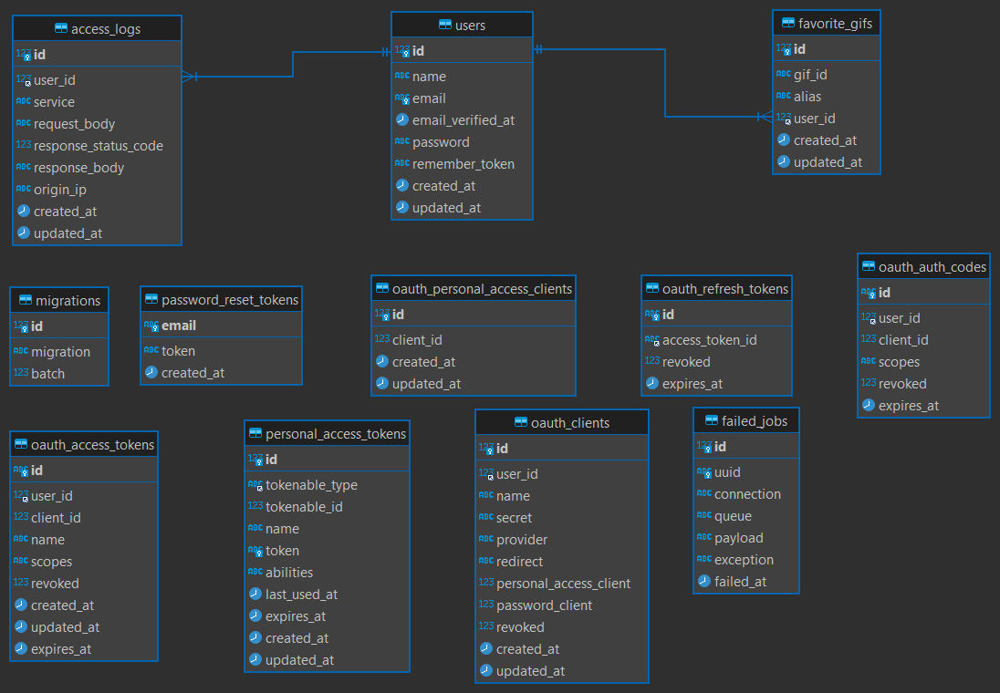

# GIPHY API

Este proyecto utiliza Docker y Docker Compose para levantar un entorno de desarrollo para una aplicación Laravel con una base de datos MariaDB.

## Requisitos

- Docker
- Docker Compose

## Configuración del Proyecto

### 1. Clonar el Repositorio

Clona el repositorio de tu proyecto en tu máquina local.

```sh
git clone https://github.com/tu_usuario/tu_proyecto.git
cd tu_proyecto
```

### 2. Configurar el Archivo .env

Dentro de la carpeta src opia el archivo de ejemplo .env.example a .env y ajusta los valores según sea necesario.

```sh
cp .env.example .env
```

Asegúrate de que las siguientes variables estén correctamente configuradas en el archivo .env:

```env
DB_CONNECTION=mysql
DB_HOST=127.0.0.1
DB_PORT=3306
DB_DATABASE=laravel
DB_USERNAME=root
DB_PASSWORD=password
```

### 3. Construir y Levantar los Contenedores
Usa Docker Compose para construir y levantar los contenedores del proyecto.

```sh
docker compose up --build
```

Esto construirá las imágenes de Docker para los servicios definidos en docker compose.yml y levantará los contenedores correspondientes.

### 4. Acceder a la Aplicación
Una vez que los contenedores estén levantados, puedes acceder a la aplicación en la url http://localhost:8000. (configurado en ese puerto para poder ejecutar las pruebas desde postman)

### 5. Ejecutar Comandos de Artisan
Para ejecutar comandos de Artisan dentro del contenedor app, usa el siguiente comando:

```sh
docker compose exec app php artisan <comando>
```
Por ejemplo, para ejecutar los tests:

```sh
docker compose exec app php artisan test
```

## Pruebas de POSTMAN

Se encuentran en el archivo:

```/Documentación/Giphy.postman_collection.json```

## Diagramas

### Diagrama de casos de uso


### Diagrama de secuencia


### DER

